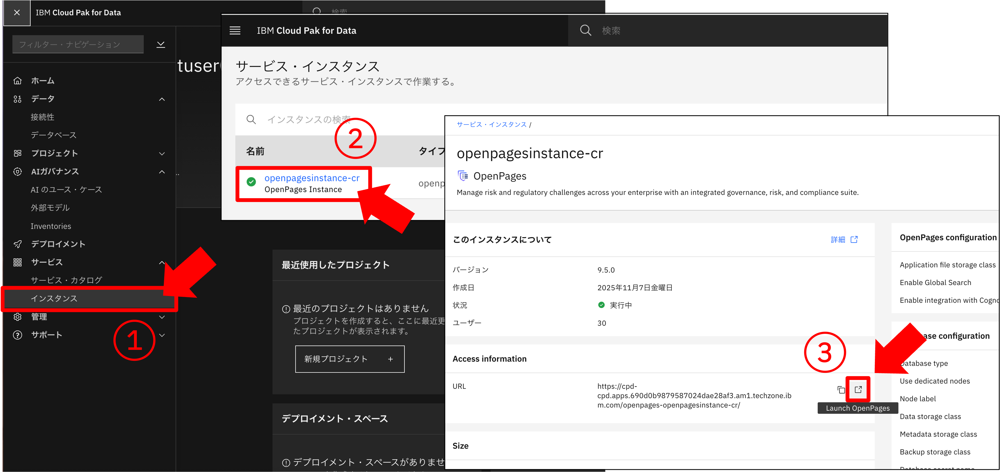

## 演習1：watsonx.governanceへのログインと基本設定
### 1. watsonx.governanceへのログイン
以下のURLへアクセスします。

https://cpd-cpd.apps.690d0b9879587024dae28af3.am1.techzone.ibm.com/zen/?context=icp4data#/homepage

ユーザー名 、パスワードを入力し、ログインボタンをクリックします。

ユーザー名（例としてtestuser01の方の場合。それぞれご自身の番号を入力してください。）：
```
testuser01
```
パスワード（全員共通）：
```
Techxchange123
```

ログインに成功すると下のような画面が表示されます。


### 2. governance consoleを立ち上げる

①左上のメニューより、`サービス`＞`インスタンス`をクリックします。（下画面①参照）

②インスタンスに表示されている`openpagesinstance-cr`をクリックします。（下画面②参照）

③`Access information`のリンクをクリックすると、ガバナンスコンソールが別ウィンドウで開きます。（下画面③参照）



ガバナンスコンソールが立ち上がると以下の画面が表示されます。


### 3. 基本設定（表示言語の変更）

表示言語の変更はロケールの設定から行います。
※デフォルトは英語（米国）です。

右上の人のアイコンをクリックし、`Change Locale`をクリックすると、任意のロケール（表示言語）を選択できるようになります。

ここでは`Japanese`を選択し、保存をクリックします。


ここまでで演習1は終了です。

演習1では、watsonx.governanceへのログインと、governance consoleの言語設定を完了しました。

続いて演習2に進みます。