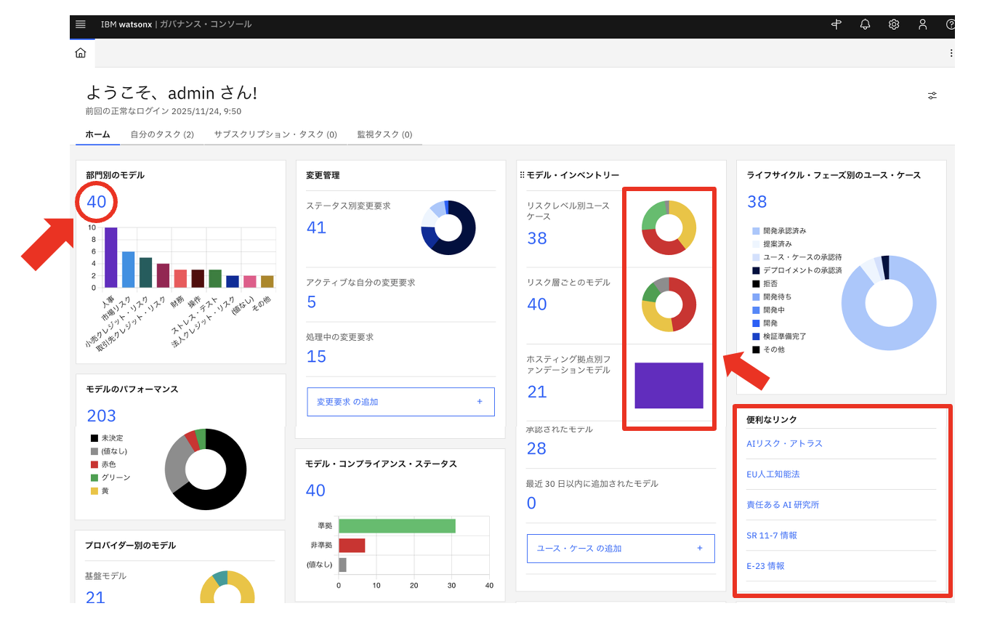
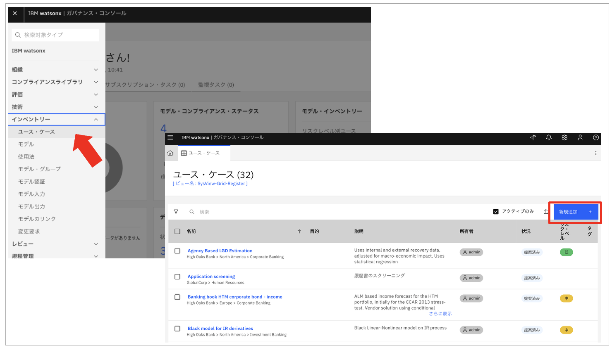

## 演習2：ユースケース策定
ここからは、以下のワークフローの流れを実際に行なっていきます。

演習2では業務部門の一員としてユースケースの登録を行います。


### 1. ダッシュボードの基本操作 (画面表示説明)

ダッシュボード上のチャートや数字はすべてリンクになっています。

クリックすると該当データの一覧や詳細を確認することができます。



### 2. ユース・ケースの新規追加

方法1または方法2でユース・ケースの追加を行っていきます。

#### 方法1：ダッシュボード画面のボタンから追加

モデル・インベントリーのチャートの一番の下の`ユース・ケースの追加`をクリックすると、新規ユース・ケース作成画面が表示されます。


#### 方法2：ユースケースの一覧画面から追加

左上のハンバーガーメニューのインベントリーから`ユース・ケース`をクリックすると、ユースケースの一覧が表示されます。

表の右上の`新規追加`をクリックすると、新規ユース・ケース作成画面が表示されます。



### 3. 新規ユース・ケース作成画面

以下のような新規ユース・ケース作成画面が表示されているはずです。


- 入力必須項目には ★ が付与されています。
- 画面左側の入力項目に直接カーソルを合わせて入力するほか、画面右側（ガイドエリア）赤枠内の項目をクリックして該当項目にフォーカスを移動させて入力する方法があります。

### 4. 新規ユース・ケース（一般）入力

では、起案するユースケースについて、実際に情報を入力していきます。

入力は自由に記述することができますが、思いつかない方は以下の＜入力のサンプル＞を参照してください。

⚠ 自由に記述される方も、**②は＜入力のサンプル＞**に従って入力してください。

なお、丸で囲われた番号は上で掲載している新規ユース・ケース作成画面の番号に対応しています。

＜入力のサンプル＞

①名前：

⚠ 同じ名前でのユースケースの登録はシステム上できないのため、**自身の番号**を最後に追加してください。

testuser01の方の場合、
```
中途採用AIエージェント01
```

②所有者：

自身のユーザ名`testuser01 - 23`を入力してください。

testuser01の方の場合、
```
testuser01
```

③目的：

```
採用活動にかかるTATの大幅削減、市場の動向を捉えタイムリーに中途採用の募集をかけることにより、今必要な人を必要なだけ採用できる中途採用のシステムを実現する。
```

④説明：

```
自社採用活動のAIエージェント化。
・適切なタイミングで最適な人材の確保
・採用活動におけるTATの大幅改善
・アーリーアダプターとしてのブランディング
```

### 5. 新規ユース・ケース（ビジネス・エンティティー）入力

画面を下にスクロールすると、ビジネス・エンティティーの項目があります。

右上の`追加`ボタンから、IBMを検索し、`人事部門`を選択し、`完了`ボタンをクリックしてください。


必要な情報の入力が完了したら、右上の`保存`をクリックします。


データが保存されると、承認ワークフローが自動的に起動され、画面右側に状況が表示されます。

ワークフローのステージが`Use Case Data Gathering（データ収集)`に進み、状況が`提案済み`に更新されていることが確認できます。

画面右上の青の`アクション`ボタンをクリックし、`初期承認のための送信`をクリックします。

アクション実行の確認ダイアログが表示されるので、左側の`続行`をクリックします。


すると、状況が`ユースケースの承認待ち`に更新され、リスク管理部門へ初期承認のタスクが割り当てられます。

watsonx.governanceでは、ワークフローを次に進める操作を**アクション**と呼んでいます。  

ここまでで演習2は終了です。

演習2では、業務部門の一員として、新規ユースケースの作成および登録を完了しました。

続いて演習3に進みます。