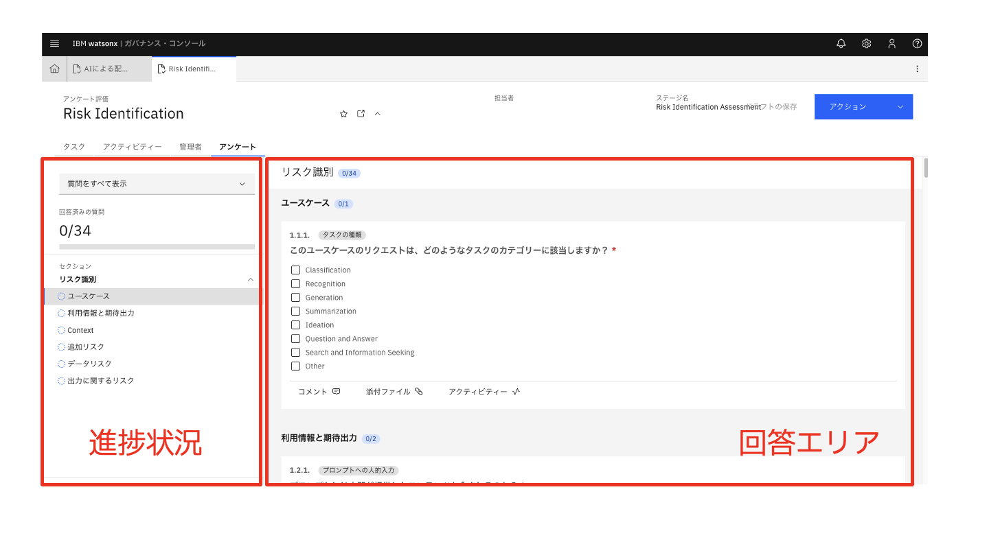
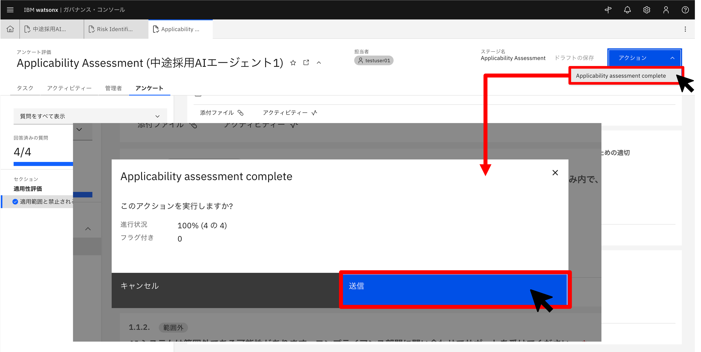
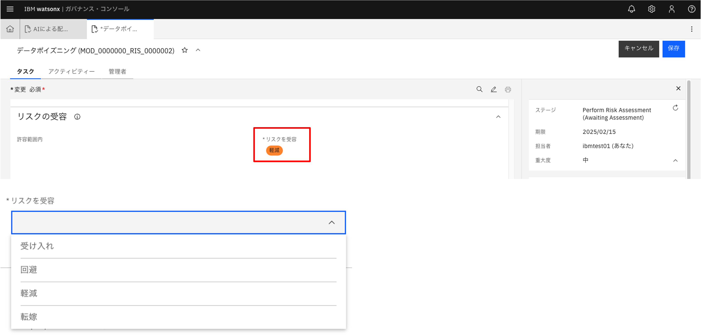
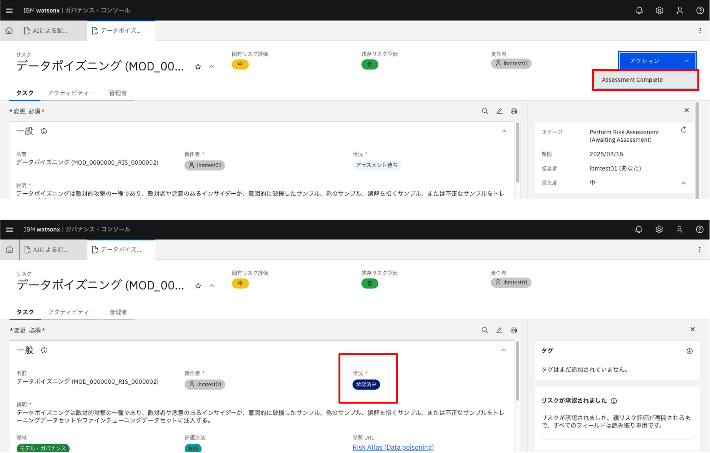
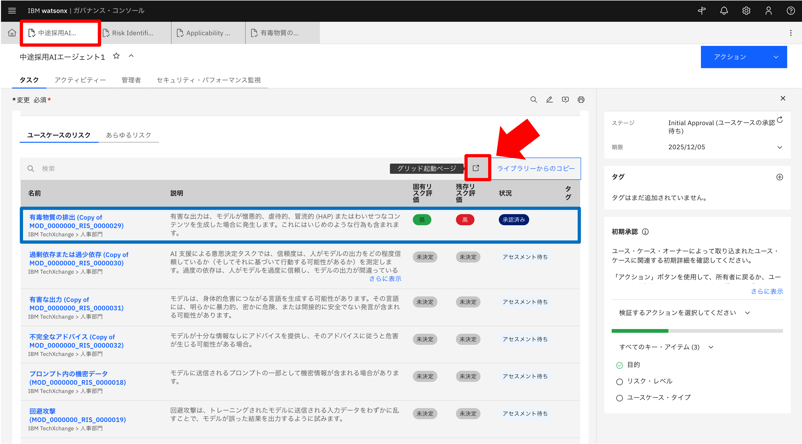
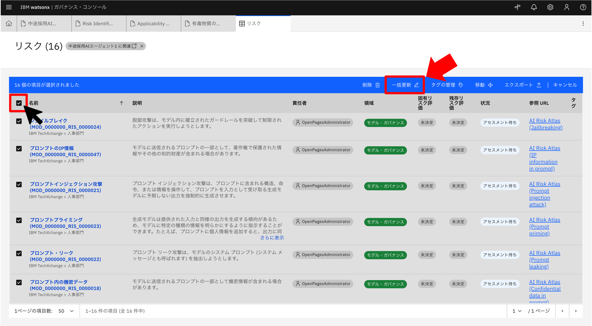
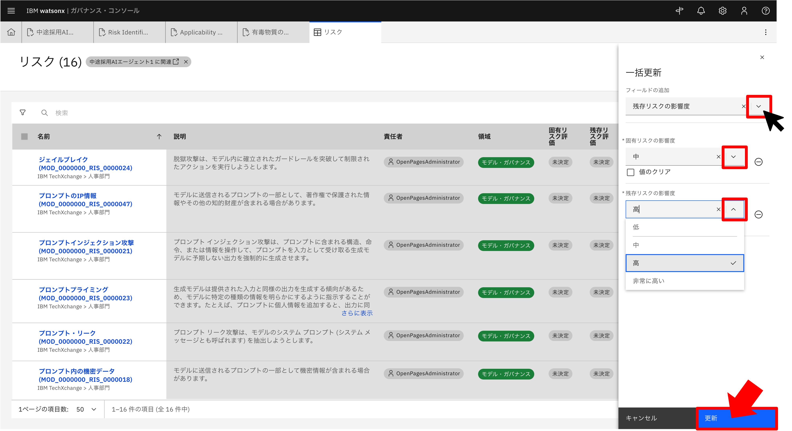

## 演習3：リスク評価の実施

演習3ではリスク管理部門の一員としてユースケースの登録を行います。

### 1. タスク確認

ホーム画面に戻り、`自分のタスク`タブで割り当てられているタスクを確認することができます。

watsonx.governanceではワークフロー実行により、担当者へタスクを割り当て、状況を確認することができます。

タスク割り当て時にメール通知を行うこともできます。  

### 2. Risk Identificationへの回答

`Risk Identification`をクリックします。

アンケートに回答します。

アンケート回答をもとに、**評価対象となるリスクの識別**を行います。

画面左側が進捗状況、画面右側が質問回答エリアになっています。

回答は`ドラフトの保存`ボタンをクリックすることで途中の状態を保存できます。また、一定のタイミングで自動保存されます。

途中、コメントを求められる質問があります。

左下の`コメント`をクリックし、回答を入力後、右矢印をクリックします。

全ての質問に回答したら、画面右上の`アクション`ボタンより、`リスク識別の完了`をクリックします。  

### 3. 評価対象のリスクの確認

ユースケース画面に戻ります。（下図参照）

Risk Identificationアンケート回答内容に応じて、評価対象となるリスクが自動的に割り当てられていることが確認できます。

割り当てられたリスクは[IBMリスク・アトラス](https://www.ibm.com/docs/ja/watsonx/saas?topic=ai-risk-atlas)に基づいており、サイトから各リスクの詳細を確認できます。

※ IBM リスク・アトラス：生成AIや機械学習モデルの使用に伴うリスクを分類・整理し、体系化したもの。

ユースケース画面をさらに下にスクロールし、[関連付け] セクションのツリー図でも、このユースケースにリスクが複数関連付けられていることが確認できます。ツリー図は、該当データと関連するデータを視覚的に把握するために用いることができます。ツリーに表示されているデータ名称をクリックすることで詳細を確認することもできます。

さらに、ツリー図でリスク名称をクリックするとを該当リスク情報が画面右側に表示されます。

### 4. Applicability Assessmentへの回答

`ホーム画面`→`自分のタスク`→`Applicability Assessment`をクリックし、Risk Identificationと同様にアンケートに回答します。

全ての回答を記入したら、画面右上の`アクション`ボタンより、`Applicability assessment complete`をクリックします。

ユースケース画面に戻り、下にスクロールすると、`EU AI リスク・カテゴリー`がアンケート回答に従い更新されていることが確認できます。

以下の例では「高」リスクと判断されていますが、他にも「禁止AI」「限定リスクAI」「最小リスクAI」「範囲外」の分類があります。

以上で、リスク評価対象項目の識別とEU AI 規制法におけるリスク・レベルの判定は完了です。

### 5. リスク評価

少し画面を上にスクロールすると、3.で確認した[ユースケースのリスク一覧]があります。一番上に表示されているリスクを選択し、遷移先の画面右上の `アクション`より `Model Risk Assessment の開始`→`続行`（左側）をクリックします。

リスク内容を確認し、評価対象かを確認後、画面右上のボタンよりアクションを実行します。
- `Ready for Assessment`：リスク評価対象とし後続の評価へ進みます。
- `Risk Not Applicable`：評価対象外のリスクの場合、評価を終了します。この場合、リスクの [状況] は「適用外」に更新されます。

ここでは`Ready for Assessment`→`続行`を選択し、リスクに対する対応を選択します。

[リスク・アセスメント]タブ内のそれぞれの項目に対して、「低」「中」「高」「非常に高い」のいずれかを選択します。[固有リスク評価]は[固有リスクの影響度]・[固有リスクの発生確率]によって、[残存リスク評]は[残存リスクの影響度]・[残存リスクの発生確率]によって自動で値が出力されます。

また、[固有リスクの影響度]と[残存リスクの影響度]の間の項目の[緩和戦略]にも文を記述します。

下図の用語について、
- 固有リスク：該当リスクが本来持っているリスクの大きさを評価します。
- 緩和戦略：固有リスクを軽減するための戦略を記入します。
- 残存リスク：固有リスクに対し緩和戦略を適用後に残っているリスクを評価します。

画面を下にスクロールすると、[リスクの受容]タブがあります。クリックして展開します。右側の[リスクを受容]と書かれた箇所にカーソルを合わせると鉛筆のマークが現れるのでそのままクリックします。すると、下に空欄のボックスが出てきます。ボックスの中にカーソルを合わせてクリックすると、受容方法の候補（「受け入れ」「回避」「軽減」「転嫁」）が表示されます。いずれかを選択してください。

入力が終了したら、画面右上の`保存`をクリックします。

すると画面が遷移し、同じ場所に`アクション`ボタンが現れます。`アクション`→`Assessment Complete`→`続行`をクリックしてリスク評価を完了します。すると、遷移した先の画面で[状況] が「承認済み」に更新されていることが確認できます。

ユースケース画面に戻り、下にスクロールします。[ユースケースのリスク一覧]の先ほど選択して入力を行ったリスクは、[固有リスク評価]・[残存リスク評価]・[状況]が表示されているはずです。

### 6. リスク評価一括入力

ワークフローを次に進めるために関連付けられているリスクの [状況] が 「承認済み」もしくは「適用外」となっている必要があるため、その他の割り当てられたリスクに関しても評価を完了します。

先ほど紹介した手順通りに、1つずつ入力をしていくことも可能ですが、今回は時間の都合上、一括でリスクの評価を行うため、`グリッド起動ページ`をクリックします。（下図参照）

[名前]左隣のチェックボックスをクリックして、リスクを一括選択したのち、`一括更新`をクリックします。

[フィールドの選択]配下の空欄のボックスをクリックし、[固有リスクの影響度]を選択します。すると下に新たに[固有リスクの影響度]の選択画面が表示されるので、任意の影響度を選択します。

同様の手順で、再度[フィールドの選択]配下のボックスをクリックし、[残存リスクの影響度]を選択します。下に新たに[残存リスクの影響度]の選択画面が表示されるので、任意の影響度を選択します。

また、再度[フィールドの選択]配下のボックスをクリックし、[状況]を選択します。下に新たに[状況]の選択画面が表示されるので、[承認済み]を選択します。

選択し終わったら、右下の`更新`ボタンをクリックします。画面中央に表示されるポップアップの`確認`ボタンをクリックし、リスク一括更新を完了します。

ユースケース画面に戻り、下にスクロールすると[ユースケースのリスク一覧]に先ほどの一括更新が反映されていることが確認できます。

ここまでで演習3は終了です。

演習3では、アンケートの回答及びリスクの評価を完了しました。

続いて演習4に進みます。