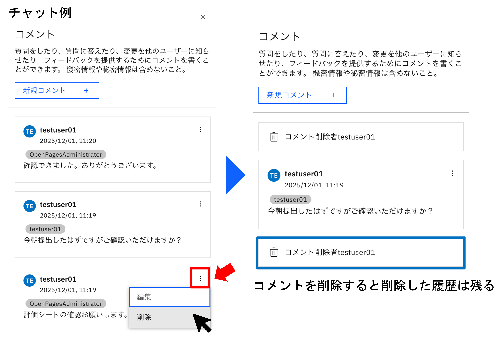

## 演習5：コメントの追加とユースケース画面カスタマイズ

### 1. コメントの追加

ユースケースに対するコメント機能を紹介をします。

まず、コメントをしたいユースケースのページを開きます。

一般タブの右上の[吹き出しマーク]をクリックします。


すると画面右側にコメントタブが開きます。

`新規コメント`ボタンをクリックします。


コメント内では`@`をつけることで、メンションをする人を選択可能です。メンションをつけられた人には、メールで通知されます。

コメントを書き終えたら、`コメント`ボタンをクリックして、メッセージを送信します。


それぞれのコメントの右上の[点が縦に3つ並んでいるアイコン]から、コメントの`編集`または`削除`が可能です。

コメントが削除された場合、削除されたことを知らせるガイドは残ります。



以上でコメント機能の紹介を終わります。

### 2. ユースケース画面カスタマイズ

次に、ユースケース画面のカスタマイズを行います。

画面右上にあるギアアイコンをクリックすると、タブが表示されます。`ソリューションの構成`→`ビュー`の順にクリックします。


画面が遷移したら、画面右にある`新規追加`ボタンをクリックします。


すると、画面右側にビューの追加という名前のタブが開きます。ここでビューの追加に必要な項目を埋めていきます。

名前（ラベルは名前に応じて自動で変更されます。）：
```
test
```
オブジェクト・タイプ：`ユースケース`を選択

ビューからコピー：`ビューの選択`→`watsonx-governance-Task-Register`→`選択`

☑︎全てのプロファイルで、〜：クリックして有効にする

全て入力し終わったら、画面右下`作成`ボタンをクリックします。


画面が遷移したら、画面左側にタグ一覧があります。その中から`インライン説明`を見つけて、画面中央の[一般]枠内に、[ドラッグ&ドロップ]します。

画面右側にインライン説明の編集画面が現れるので、必要な項目を埋めていきます。入力し終えたら、右下の`完了`ボタンをクリックします。

名前：
```
Guide
```
ヘルプ・トピック：
```
Guide
```
ヘルプ・テキスト：
```
ユースケースの基本情報を入力します。
必要項目への入力が完了したら、右上の保存をクリックします。
```


画面左上の`プレビュー`→`ユースケースの選択`ボタンをクリックするとポップアップが現れます。

左上の検索欄にユースケース名を入力して（ここでは[中途]と入力）該当のユースケースを選択します。`完了`ボタンを押すと、ユースケースの選択が完了します。


画面が切り替わると、先ほど追加した[Guide]と説明が表示されているはずです。


以上でユースケース画面のカスタマイズの紹介を終わります。

ここまでで全ての演習が終了しました。お疲れ様でした。