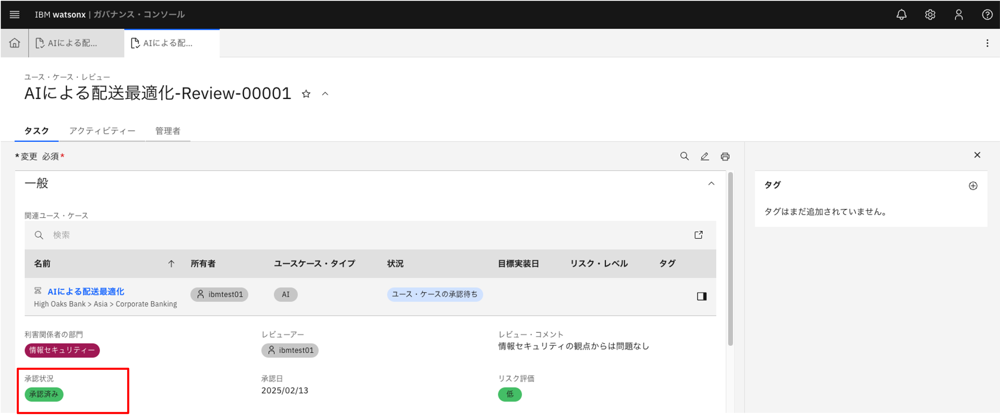

## 演習4：ユースケース承認の実行

演習4では利害関係者の一員としてレビューを行います。

### 1. 利害関係者レビューの依頼

画面（ユースケース画面）を上にスクロールし、[一般]タブの中の[利害関係者の部門]をクリックして任意の部門を追加します。

同様に[ユースケースの詳細]タブの[基盤モデルを使用]をクリックして[はい]を選択します。

画面右上の`保存`をクリックして入力内容を保存します。

次に、画面右上の `アクション`→`利害関係者のレビューを依頼`→`続行`をクリックします。選択した利害関係者部門用の承認用データが自動的に関連付けられます。

別のアクションについて、
- `ユースケースの拒否`：該当ユースケースを却下し、承認フローを終了します。
- `所有者に戻る`：所有者に差し戻しを行い、評価結果の見直しを実施します。

画面を下にスクロールすると、[ユース・ケースの承認]タブがあります。先ほど選択した利害関係者の数だけ、レビュー画面が用意されています。例として一番上のリンクをクリックします（ここでは「情報セキュリティー」部門のデータ）。

### 2. 利害関係者レビューの実行

遷移先画面で[一般]タブの中の[レビュアー]をクリックし、仮に自分を設定します。（`testuser01`の方の場合、`testuser01`を設定）

同じタブ内の[レビュー・コメント]、[リスク評価]をそれぞれ記入します。

記入したら画面右上の`保存`ボタンをクリックし、その後`アクション`→`ユースケースの承認`→`続行`をクリックします。

[ユース・ケースの拒否] を選択した場合には、該当ユースケースは却下されます。

[承認状況] が、「承認待ち」から「承認済み」へ更新されます。同様に他の利害関係者レビューも実施します。

### 3. 利害関係者レビュー後 手続き

全ての利害関係者レビューが完了したら、画面右上の`アクション`→`開発の承認`→`続行`をクリックします。

[状況] が「開発承認済み」に更新され、該当ユースケースのモデル開発に進むことができるようになります。

これで承認ワークフローが完了しました。

ここまでで演習4は終了です。

演習4では、利害関係者レビューの依頼、利害関係者レビュー、利害関係者レビュー後処理を完了し、これにて開発部門に引き渡す前までの処理が全て完了しました。

続いて応用編の演習5に進みます。